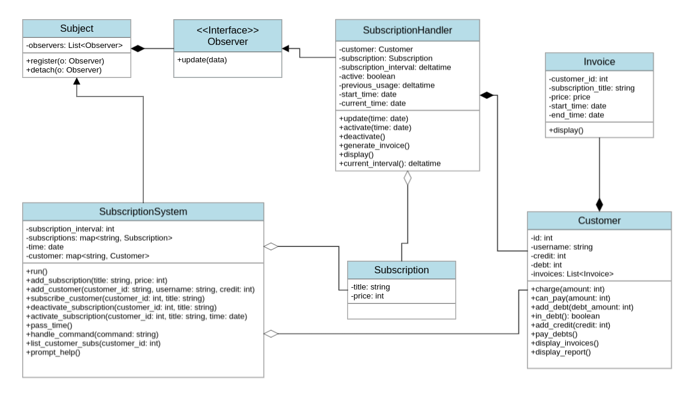

# Subscription System
Implementation of financial system of a cloud storage service with python

## Summary:
In this system, customer subscribes to a service, periodically having its credit reduced.

Each time the credit reduces, an invoice will be generated for the customer.

Customer can add/remove subscriptions.

The system must generate invoice each 10 minutes.

Customer must be able to see the list of their subscriptions and invoices.

Finally, customer must be able to recieve a report on how many invoices and how much credit 
they have spent in the system.

## UML Class Diagram:

## Install
  - ### Requirements
    - [python](https://www.python.org/downloads/)
  
  - Having installed the requirements, run the following commands in terminal:
    1. `git clone https://github.com/sananqsh/subscription_system.git`
    2. `cd subscription_system`
    3. `python3 main.py`
